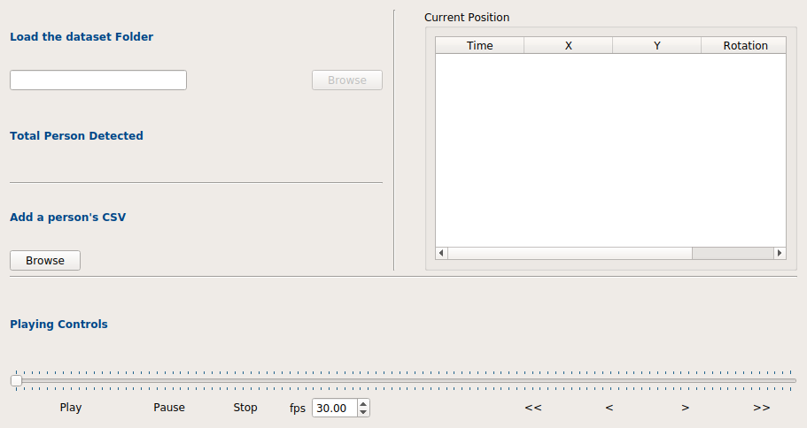

# HumanSceneSim
This component simulate the position of several persons and change their pose in the RCIS as well as in AGM.



> For a video demo go to this [https://youtu.be/5jh9AY0zq0o](https://youtu.be/5jh9AY0zq0o)

## Dataset
The SALSA dateset is used here.\
You can find the dataset [here..](http://tev.fbk.eu/salsa)\
PosterSession: [DataLog](https://drive.google.com/open?id=0Bzf1l8WmTwu0QlpnX0Q5TDdsM0E)\
CocktailParty: [DataLog](https://drive.google.com/open?id=0Bzf1l8WmTwu0QmJjM1NJNC04Z2M)

In the dataset we are intrested in the folder "***geometryGT***"

## Configuration parameters
As any other component, *HumanSceneSim* needs a configuration file to start. In
```
etc/config
```
you can find an example of a configuration file. We can find there the following lines:
```
EXAMPLE HERE
```
## Compiling the component
```
cd <HumanSceneSim path>
mkdir build
cd build
cmake ..
make
```


## Starting the component

Start the RCIS, rcnode & AGMExecutive before starting the component.

To avoid changing the *config* file in the repository, we can copy it to the component's home directory, so changes will remain untouched by future git pulls:

```
cd <HumanSceneSim's path>
```
```
cp etc/config config
```

After editing the new config file we can run the component:

```
./bin/HumanSceneSim config
```
