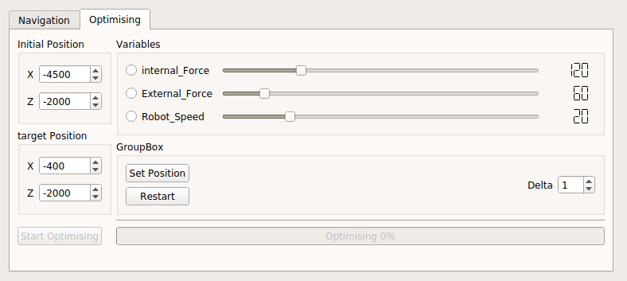
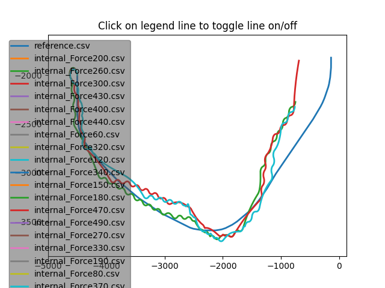

# socialNavigationAgent
This component is used to automate the process of optimising different navigations variables.




## Configuration parameters
As any other component, *socialNavigationAgent* needs a configuration file to start. In
```
etc/config
```
you can find an example of a configuration file. We can find there the following lines:
```

CommonBehavior.Endpoints=tcp -p 11320

# Endpoints for implemented interfaces
AGMCommonBehavior.Endpoints=tcp -p 10330
TrajectoryRobot2D.Endpoints=tcp -p 13204

AGMExecutiveTopicTopic.Endpoints=tcp -p 10334
RCISMousePickerTopic.Endpoints=tcp -p 13000
SocialRulesTopic.Endpoints=tcp -p 14000


#
# R E M O T E    P R O X I E S
#
TopicManager.Proxy=IceStorm/TopicManager:default -h localhost -p 9999


#local
#TrajectoryRobot2DProxy = trajectoryrobot2d:tcp -h localhost -p 19204
OmniRobotProxy = omnirobot:tcp -h localhost -p 12238
LaserProxy = laser:tcp -h localhost -p 10003
AGMExecutiveProxy = agmexecutive:tcp -h localhost -p 10198

#NavigationAgent.InnerModel=/home/robocomp/robocomp/components/robocomp-ursus-rockin/files/makeMeCoffee/simulation.xml

NavigationAgent.MaxZSpeed = 450
NavigationAgent.MaxXSpeed = 350
NavigationAgent.MaxRotationSpeed = 0.75

NavigationAgent.RobotXWidth = 540
NavigationAgent.RobotZLong = 460
NavigationAgent.RobotRadius = 400

NavigationAgent.MinControllerPeriod = 100

NavigationAgent.PlannerGraphPoints = 400
NavigationAgent.PlannerGraphNeighbours = 20
NavigationAgent.PlannerGraphMaxDistanceToSearch = 2500 #mm

NavigationAgent.ExcludedObjectsInCollisionCheck = floor_plane,ladder_mesh

#############GSOC###########
NavigationAgent.OuterRegionLeft = -7000
NavigationAgent.OuterRegionRight = 6000
NavigationAgent.OuterRegionBottom = -5000
NavigationAgent.OuterRegionTop = 5000


NavigationAgent.MinimunDetectableRotation = 0.03			# to accept a new target
NavigationAgent.MinimunDetectableTranslation = 7 			# to accept a new target

Ice.Warn.Connections=0
Ice.Trace.Network=0
Ice.Trace.Protocol=0
```

## Starting the component
To avoid changing the *config* file in the repository, we can copy it to the component's home directory, so changes will remain untouched by future git pulls:

```
cd <socialNavigationAgent's path>
```
```
cp etc/config config
```

After editing the new config file we can run the component:

```
bin/socialNavigationAgent config
```
---
## Data Viewer

Go to the trainingData folder\
There is metricCalc.py

* This file can be used to calculate different metrics based on the data.

* You can add you metrics in there.
* Also you can view it graphically.

> Dependencies required are:\
 `pip3 install matplotlib` \
 `pip3 install numpy`

 ### MetricCalc.py
 This python script will calculate and show the values in sorted order.

---

 ### GraphPlotter.py
 This python script will display the path as travelled by the robot.\
 Each color is representing a different value of the variable at which the data is captured.

> User can click on different legends to view and compare different data Plots.


 ---
